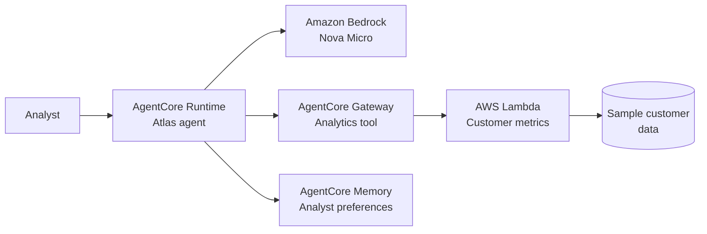

## Intent

I wanted to get more familiar with building agents on AWS, so I created a
[hands-on AgentCore lab](https://github.com/ptran32/lab-001-aws-agentcore).
The repository contains the setup, code, and commands. This post gives an
overview of the concepts and the result of each stage.

## Amazon Bedrock

Amazon Bedrock provides access to foundation models from different providers
through a managed AWS service. It also includes services for building AI
applications, such as Knowledge Bases, Agents, Guardrails, and model
evaluation.

For this lab, I used the relatively inexpensive
`us.amazon.nova-micro-v1:0` model and focused on the services around the model:
Amazon Bedrock AgentCore.

## Amazon Bedrock AgentCore

AgentCore is a modular platform for running, connecting, and operating agents.
The main building blocks are:

- **Runtime** runs and scales the agent code.
- **Gateway** connects the agent to tools, APIs, and other services.
- **Memory** provides context within and across conversations.
- **Identity** manages authentication and access to external services.
- **Observability** tracks requests, tool calls, latency, and failures.

Together, these services make it possible to deploy a complete, enterprise-grade
agentic architecture without putting every responsibility inside the model.

### Runtime

AgentCore Runtime hosts the agent code and connects it to a Bedrock model. A
toolkit such as [Strands Agents](https://strandsagents.com/) can be used to
build the agent itself.

### Gateway

Gateway provides a controlled boundary between an agent and the tools or data
it needs to use. It can connect to targets such as MCP servers, Lambda
functions, HTTP APIs, and other services.

### Memory

Memory can provide short-term context for the current conversation and
long-term context for future conversations. Long-term strategies can extract
facts, summaries, preferences, or details about previous tasks.

### Identity and Observability

Identity handles authentication and access to external services, including
connections that use IAM, OAuth or API keys. Observability helps show what the agent
did, how long it took, and where something failed.

## In practice

The lab builds Atlas, a customer insights assistant, and adds capabilities in
three stages:

### 1. Start with Runtime

Atlas can answer general analytics questions, explain customer KPIs, suggest
segmentation approaches, and write SQL examples. It cannot access the customer
data yet, so it should not invent exact counts or spend figures.

### 2. Add Gateway

The Gateway exposes an analytics tool backed by an AWS Lambda target. The Lambda
reads a sample customer dataset and returns exact counts, spend totals,
averages, and breakdowns by country or segment.

The result is an agent that can answer company-specific questions with actual
values, while keeping the data access and calculations outside the model.

### 3. Add authentication

I kept authentication simple for this lab and used IAM for both directions of
the request. The call from my laptop to the AgentCore Runtime is the inbound
path, while the call from the agent through Gateway to the Lambda function is
the outbound path.

### 4. Add Memory

Semantic Memory extracts an analyst's preferences, such as grouping reports by
country, and makes them available in a later session. Gateway still provides
the current customer metrics, while Memory provides continuity.

## What I want to explore next

I want to learn more about Harness for managing agent execution and
coordination, Policy for controlling allowed actions and tool calls, and
Monitoring for understanding agent behaviour, latency, and failures.

I also want to become more familiar with inbound and outbound Gateway
integrations, including OAuth providers such as Okta and Google and connectors
for services such as Slack and Jira.

## Conclusion

AgentCore feels well thought out. Its components complement each other without
much overlap, which is not always the case with AWS services.

There was a lot to read, and I am still learning how the pieces fit together.

The fact that the Strands Agents toolkit is open source is another plus.
